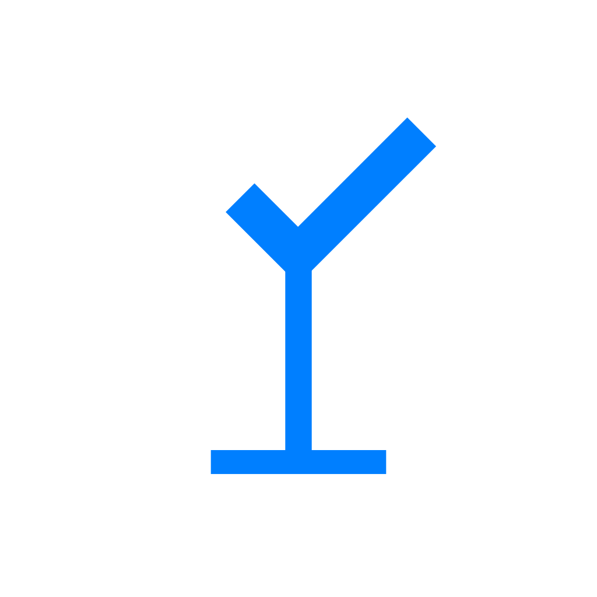

# Takt

**A keyboard-first macOS desktop app for working your task lists fast.**
Quick navigation, priority and due workflows, focus timers, a kanban board, an honest daily log, and a command line that reaches the same data.

<br clear="left" />

---

Takt opens as a desktop window, keeps a menu bar surface for quick capture, and is built to be driven without the mouse. Its own local workspace owns your tasks; Checkvist is an optional import. Takt adds the things a plain list has no representation for — priority ranking, start dates, recurrence, focus sessions, daily habits, and a record of what actually happened each day.

It works offline. It works from the terminal. And it exposes the whole surface to an AI assistant over MCP.

- **macOS 15.6+**
- Repository: [MaybeItsSoftware/priority](https://github.com/MaybeItsSoftware/priority)

## Contents

- [Install](#install) · [First run](#first-run)
- [Keyboard flow](#keyboard-flow) · [Focus](#focus) · [Command palette](#command-palette)
- [Views](#views) · [Waiting on](#waiting-on) · [The menu bar](#the-menu-bar) · [The window](#the-window) · [Themes](#themes) · [Diagnostics](#diagnostics)
- [Daily log](#daily-log) · [Obsidian daily notes](#obsidian-daily-notes) · [AFFiNE](#affine)
- [Command line](#command-line) · [MCP server](#mcp-server) · [Plugins](#plugins)
- [Build from source](#build-from-source) · [Where your data lives](#where-your-data-lives)

## Install

1. Download the latest `.dmg` from [Releases](https://github.com/MaybeItsSoftware/priority/releases).
2. Drag `Takt.app` into `Applications`.
3. Right-click it once and choose **Open**.

The build is signed with a development certificate rather than a Developer ID, so Gatekeeper will ask the first time. If it refuses outright:

```bash
xattr -cr /Applications/Takt.app
```

Or build it yourself — see [Build from source](#build-from-source).

## First run

Open Settings with `Cmd+,`. It is one window with a sidebar of pages — type
to filter them, walk them with `↑`/`↓`, or jump with `⌘1`–`⌘9`:

| Page | What |
| --- | --- |
| General | Launch at login, confirming deletes, and the completion celebration with a preview |
| Focus | Where a started block runs, and whether each block is scored |
| Appearance | The theme gallery, light/dark/system, the interface, heading and numeral fonts, and the text size |
| Keyboard | The three global hotkeys (show the window, focus panel `⌃⌥⇧⌘F`, Quick Add `⌃⌥⇧⌘D`, which opens a small window of its own over whatever app you are in — `↑`/`↓` pick the list, `←`/`→` the start day, `Return` files it, `Esc` or a click away drops it), the list Quick Add captures into, and `keymap.json` |
| Integrations | One page per integration — Checkvist, Obsidian, AFFiNE, Google Calendar, Google Tasks, MCP, Daily Log — and your installed plugins |
| Sync | The account that keeps the Mac and phones on one workspace, on Takt's server or [your own](docs/self-hosting.md) |
| Advanced | Export the workspace as Markdown or JSON, diagnostics, and the app's data folder |

None of it is required: the workspace is local-first and works with every row
left alone. Checkvist, Obsidian and Google Calendar are set up from their own
pages under **Integrations**, when you want them.

## Keyboard flow

The window is keyboard-first: every mode, every surface and every task action
has a key. The mode strip names the modes, and the View, Task and Workspace
menus list what you can do with the key beside each item — every task action
is in the Task menu, and the ones whose key is a two-letter sequence have a
chord as well so the menu can show one. So none of it is reachable only by
something you already have to know.

| Key | Action |
| --- | --- |
| `Cmd+1`–`Cmd+4` | Today, Board, Outline, Matrix (`Cmd+T` is Today too) |
| `Cmd+8` / `Cmd+9` | The focus panel / the timeline, a tab in the right dock |
| `Cmd+0` / `Cmd+E` / `gh` | Everything, across all active lists |
| `Cmd+I` | The Inbox |
| `Ctrl+1` / `Ctrl+2` / `Ctrl+3` | Focus the sidebar, the task surface, the inspector |
| `Cmd+B` | Show or hide the sidebar (Zed's left dock) |
| `j` / `k` / `↑` / `↓` | Move the selection |
| `Cmd+↑` / `Cmd+↓` | First / last task |
| `Alt+↑` / `Alt+↓` | Move the task up / down (Zed's move line) — on Today, earlier or later in the day |
| `Alt+←` / `Alt+→` | Outdent / indent the task — out of, or under, the task above |
| `Cmd+←` / `Cmd+→`, or `Shift+Alt+←` / `Shift+Alt+→` | Move the card, or the subtask row you are on, a board column left / right — a subtask moved past its parent's column becomes a card of its own there (in the outline `Cmd+←` / `Cmd+→` still fold and unfold everything) |
| `Cmd+Alt+↑` / `Cmd+Alt+↓`, or `Cmd+Shift+{` / `Cmd+Shift+}` | The list above / below in the sidebar — Zed's previous / next tab (in the sidebar itself `Cmd+Alt+↑` / `↓` still move a folder; `Cmd+Alt+←` / `→` outdent and indent the task, as `Alt+←` / `→` do) |
| `Ctrl+-` / `Ctrl+Shift+-` | Back / forward through the lists you have been in — Zed's go back / go forward |
| `Shift+Alt+↑` / `Shift+Alt+↓` | Move the task to the list above / below in the sidebar (`mm` picks any list) |
| `Ctrl+T` | Plan the task for today, or take it off |
| `gb` / `Cmd+Shift+H` | Make a habit from the task, or edit the habit it is — see [Habits](#habits) |
| `ww` | Waiting on: who or what, and when to follow up — moves the task to Waiting on; see [Waiting on](#waiting-on) |
| `Delete` / `Cmd+Delete` / `Cmd+Shift+K` | Delete the task — it asks, and `Return` confirms |
| `Return` | **Always** add a task, as in Checkvist — below the selection — on the board, below the card a selected subtask is drawn on — and at the foot of the day on Today |
| `Space` / `x` | **Always** complete the task (or reopen it) — unless you are typing |
| `Shift+Space` | Cancel the task, or reinstate it — it stopped mattering, rather than got done |
| `tc` | Hide or show completed tasks — a completed task stays put for three seconds and then leaves the list; `tc` shows them all again |
| `f` | Start a focus block on the task — on Today, queue it behind a running block |
| `l` / `]` | Open the task's subtasks |
| `→` / `←` | In the outline, show a task's subtasks and step into them / hide them and step out — without opening the task. Elsewhere, open and leave it. At the top level of a list, `←` goes back to the list in the sidebar |
| `za` / `Cmd+←` / `Cmd+→` | Fold or unfold the task you are on (outline or board) / fold / unfold the whole outline |
| `.` / `,` | Grow the task you are on to show its subtasks / shrink it (on a task with none, folds the one it sits under) |
| `Cmd+Shift+C` / `Cmd+Ctrl+C` | On the board, add a column / remove the one you are in |
| `Cmd+N` / `Cmd+Shift+N` / `Cmd+Alt+N` | New task / list / folder |
| `F2` / `Shift+R` | In the sidebar, rename the list or folder you are on |
| `Shift+Return` / `Alt+Shift+Return` | New task above the selection (Checkvist's) / new subtask |
| `Cmd+F` / `Cmd+Shift+F` | Search |
| `Cmd+P` / `gl` | Go to a list — opened empty, it lists the ones you were in most recently first. Every list and nested list, matched by the letters you type (`wsr` finds "Write the spring report"), with its folder beside it. Clicking the list's name at the top of the pane opens it too |
| `Cmd+Ctrl+I` / `Cmd+Ctrl+D` | The right dock on its Inspector / Done tab, or put it away |
| `Cmd+Shift+A` | The left dock's Agent tab — Claude Code, asking before every change |
| `Cmd+J` | The bottom dock: a graph of tasks done and added per day (Zed's bottom dock) |
| `Cmd+R`, `r` or `Cmd+Alt+B` / `Cmd+Alt+Y` | The right dock, on the tab it was on and with the keyboard in it, or put it away / close all docks (Zed's) |
| `Cmd+Shift+{` / `Cmd+Shift+}`, or `[` / `]` | In the right dock, its previous / next tab — Inspector, Done, Timeline — with the keyboard brought along (Zed's previous / next tab; on a task pane the same chords change list). `Ctrl+Tab` leaves it for the next region |
| `oo` / `Cmd+Alt+I` | List settings |
| `Cmd+Z` / `Cmd+Shift+Z`, or `Ctrl+Z` / `Ctrl+Shift+Z`, or `uu` | Undo / redo |
| `Cmd+Shift+P` / `Cmd+K` | The command palette — everything the workspace can do, and its key |
| `Cmd+/` | The same commands, grouped as a reference |
| `Esc` | Cancel what you are typing, or leave the surface you are in |

In the sidebar the keys are Zed's project panel's, lists standing in for files
and folders for directories: `Cmd+N` new list and `Cmd+Alt+N` new folder beside
the row you are on, `F2` rename, `Delete` delete (it asks), `Cmd+←` / `Cmd+→`
collapse / expand every folder, `→` (or `l`) opens the row. On a folder that is already open, `→` **enters** it: its lists' tasks together on one board or outline, with the keyboard on them, so you can work through the folder without opening each list. On a list, `→` goes into its tasks the same way. `Return` is not "open" anywhere, the sidebar included — it adds a task to the list you are on, as it does everywhere else. Its vim panel's netrw
keys work too: `d` new folder, `%` new list, `Shift+D` delete, `Shift+R`
rename, `h` / `l` / `-` collapse, expand and go up, `gg` / `Shift+G` the ends,
`{` / `}` the previous / next folder and `:` the palette.

The palette, search, the list finder, the move picker, quick edits (`t`, `dd`,
`ee`…), the reference and the new list / folder / column prompts all open in
one **overlay** at the top of the window rather than as sheets. One is up at a
time and asking for another replaces it (`Cmd+K` from search opens the
palette); `Esc` or a click outside closes it, and `Return` confirms — in a
notes edit too, where `Shift+Return` is the new line.

The arrows read by modifier. Bare, they move the cursor, and past the last row
it wraps to the first (and back from the first to the last); with `Cmd`, they
move it to the ends. In the sidebar, `→` on a folder that is already open
enters its tasks (`Return` adds a task there, as everywhere). `Alt` moves the *task* within its list — up and down among its
siblings, out and in a level. `Shift+Alt` carries it somewhere else — another
board column, another list. `Ctrl` is left to macOS, which gives it and the
arrows to Spaces and Mission Control.

The table above is the short version. The complete one is in the app: `Cmd+K`,
or a **double-tap of Shift**, opens the palette, and `Cmd+/` — or the keyboard icon in
the status bar — shows the same commands as a grouped reference. Both are rendered from a single catalogue in
`Sources/TaktCore/WorkspaceCommandCatalog.swift`, which is also what the
key router dispatches through — so a key, a palette row and a reference row
cannot disagree about what happens. [`docs/keyboard-shortcuts.md`](docs/keyboard-shortcuts.md)
covers the behaviour a table cannot: sequence timing, which keys survive a text
field, which surfaces take the keyboard outright, and how to rebind any of it
in `~/Library/Application Support/Takt/keymap.json` (**Open the keymap
file** in the palette).

### Typing a task

A new task can say more about itself than its title. End it with any of these
and they are set as it is filed, rather than by opening the task again straight
afterwards:

| Ending | Sets |
| --- | --- |
| `30m`, `1h`, `1.5h`, `1h30m` | The estimate (up to a day) |
| `@today`, `@tomorrow`, `@fri`, `@3d`, `@2w`, `@2026-10-02` | The day it is due — a weekday means the next one, today included. `^` works as well as `@`, as in Checkvist (`^fri`) |
| `#work` | A tag — it has to start with a letter, so `#12` stays in the title |
| `!1`–`!4` | The priority |
| `wait:Sam` | Waiting on Sam — filed in the Waiting on column straight away |

`Write the release notes 45m #work @fri !1` files a task called "Write the
release notes", estimated at 45 minutes, tagged `work`, due on Friday, at
priority 1.

The same endings work when you **edit a title in place**. In the outline,
`F2`, `ee` or a click on the task already selected turns its title into a field
in the row, as in Checkvist; `ea` starts typing at the end of the title and `ei`
at the start, as vim's `a` and `i` do: type ` ^fri !2` after the title and Return, and the
title stays as it was while the due day and priority change. Tags are added to
the ones the task has. Escape puts the title back; clicking away saves.

In the row that opens for a new task (`Return`, `Shift+Return`), `Tab` makes it a
subtask of the task above and `Shift+Tab` takes it back out, before you type or
after. `↑` and `↓` close the row, dropping what was typed as `Escape` does, and
carry on to the task above or below where it sat.

Only the **trailing** words are read, and the first word from the end that is
not one of these stops the reading — so a title is never rewritten in the
middle: `Read 30 pages` and `Buy 2m of cable` keep every word. The first word is
always the title's, and a second estimate, day or priority stops the reading
too, leaving the earlier one in the title where you can see it. As you type,
what will be set shows as chips beside the field — in the title bar's **Add a
task** and in the focus panel's "Add … to today" row — so nothing is a surprise
after Return.

### Coming from Checkvist

The desktop workspace supports Checkvist-style two-letter commands, including
`uu`, `ee`, `dd`, `nn`, `tt`, `mm` and `ww`, plus native undo/redo in the
Edit menu. Board arrows navigate every column, including empty ones, and
`Up`/`Down` step through the subtask rows drawn on each card as well as the
cards (folded cards are skipped over); `Space` completes the row you are on and
`Return` adds a task, as Checkvist's do. The sidebar outlines the list you are navigating.

A task you tick off stays where it was for three seconds — long enough to see
it go and to take it back — and then leaves the list; the Done rail keeps it.
`tc` shows every completed task again, and toggles back.

Subtasks fold where they stand, as they do in Checkvist, so you can look
inside a task without opening it: in the outline `→` unfolds a task and steps
into its subtasks and `←` folds it and steps back out, `za` folds the task you
are on in the outline or on a board card, and every row with subtasks has a
chevron. Folds are shared by the outline and the board and kept across
launches — see [`docs/keyboard-shortcuts.md`](docs/keyboard-shortcuts.md#folding-subtasks-where-they-are).

Checkvist's `ll`, `hc` and `hh` are `gl`, `tc` and `gb` here, so that `l` and
`h` — open a task's subtasks and leave them — never wait. A letter that begins a
sequence and also means something on its own, which leaves only `x` (complete,
or `xx`), waits up to 1.2 seconds for a second letter, then does its own job. Any other
key ends the wait at once, and holding Shift (`⇧X`) skips it. A letter that
begins no sequence where you are never waits.

The one-letter root tabs that used to collide with those sequences are gone
with the menu bar panel they belonged to, so a sequence no longer has to
compete with a tab for its starter letter.

## Today

The window opens on **Today**: the day as a numbered list of cards, the same one
the hotkey summons over other apps. One component, two mounts — a day that read
differently depending on where you opened it would be two days.

Each card carries what the task is, what it should cost, and what it has cost so
far. `f` (or `Tab` in the panel) on a card starts it; the card you are on grows a live clock and a
strip of pause, skip, log and done, so a whole block runs without the list ever
going away.

The day also says when it ends: the header reads like `1h 20m of 3h · 1h 40m
left · done by 17:35` — what the estimated tasks still owe, worked straight
through from now, counting the block that is running. Tasks with no estimate
are left out of it (the tooltip says how many), and in the window clicking a
card's estimate, or its "No estimate", opens the same estimate editor as
`Option+T`.

The two mounts differ in their chrome only. In the window the pane is its header
— the scope, and time logged against the day's estimates — and the list, walked
with the ordinary selection keys like any other pane. The day's other numbers
are in the status bar (click them for the timeline), a task is added from the
title bar's field — which, while Today is up, puts it on today — and a search is
`Cmd+F`. The summoned panel has no title bar or status bar to lean on, so it
keeps its own: a bar of estimated against logged under the same finish time, a line setting today against
the week, a list of the day's logged blocks, and a field that searches every
task's title and notes and offers to add what you typed to today.

Anything already done is ticked off from here rather than somewhere else: each
card's number becomes a tick when the pointer is over it, and `Space`
does the same to the card you are on. Finishing plays whichever celebration is
configured, wherever it was finished from.

A task that owes the day a **daily contribution** is badged where it is read
rather than gathered into a screen of its own — a daily is a requirement placed
on an ordinary task, not a kind of item. Clicking the badge records today's
contribution without starting a block; the task itself stays open until it is
genuinely finished, and ticking off such a task records the contribution rather
than closing it.

The window also carries a strip naming which of the four modes is up, then
Focus, which raises the focus panel, and Timeline, which opens in the right
dock beside them — so none of it is reachable only by a key you have to already know.

| Key | Action |
| --- | --- |
| `Cmd+1` / `Cmd+T` | Today |
| `Cmd+2` | Board |
| `Cmd+3` | Outline |
| `Cmd+4` | Matrix |
| `Cmd+8` | Focus — raises the floating focus panel |
| `Cmd+9` | The day's timeline |
| `Cmd+0` | Everything, across all active lists |
| `Ctrl+1` / `Ctrl+2` / `Ctrl+3` | Focus the sidebar, the task surface, the inspector |
| `Cmd+B` | Show or hide the sidebar (Zed's left dock) |
| `Up` / `Down` | Move between cards |
| `f` (window) / `Tab` (panel) | Start the card you are on, or queue it behind the one running |
| `Space` / `x` | Tick the card off without running a block — on the running card, finish it |
| `Return` | Add a task (in the panel, from what you typed) |
| `Ctrl+T` | Plan the card for today, or take it off — an overdue or dated card becomes one you placed |
| `Alt+↑` / `Alt+↓` | Arrange the day: move a planned card earlier or later, whichever lists they came from |
| `Left` | Back to the list in the sidebar (the window) |
| `Cmd+Return` | Open the card in the main window (the panel) |

The digit row used to move the caret between the window's three panes. Changing
what you are looking at is the bigger thing, so it took the row and pane focus
moved to `Ctrl`.

## Focus

Focus is the floating panel described [below](#the-focus-panel): the day to
pick from while nothing runs, and the running block's strip once something
does. There is no focus pane in the main window. `Cmd+8`, the title bar's
**Focus** button and Today's **Focus** button all raise the panel, and
`⌃⌥⇧⌘F` summons it from any app.

The quality question is what turns minutes into points, so it is asked by
default — but **Ask how each focus block went** in Settings turns it off, and
blocks then close at ×1 without stopping.

The floating clock is a **companion, not a remote control that needs its
station**: it names the task, draws the block's progress as a hairline, and
carries pause, log and done, so closing the main window while a block is running
leaves the clock up rather than taking it away. It appears on its own whenever
the last window closes on a running block.

`Cmd+9` opens the day's **timeline** as a tab in the right dock, beside the
inspector and the done rail: every block drawn against an hour ruler, with the
running one growing live, and the day's breakdown under it. `←` / `→` (or `h` /
`l`) step a day, `t` comes back to today, `↑` / `↓` (or `j` / `k`) walk the
breakdown and `o` opens the task under the cursor in its own list. `Esc` hands
the keyboard back to the work and leaves the timeline open; `Cmd+9` or `r`
puts it away.

### The focus panel

`⌃⌥⇧⌘F` summons the focus panel over whatever app you are in — the one surface
you can reach without going to the app. It comes up with the caret already in
its field, so there is nothing to click, and it comes up **alone**: the main
window stays wherever you left it, open or closed, rather than being dragged
forward along with it.

It **stays where you put it**. Clicking back into your editor does not dismiss
it: it floats above the other window, at the size and position you gave it,
until you press `Esc` or the hotkey again. Drag it anywhere, drag its edges to
resize, and it comes back the same next time. It is a panel you leave up while
you work, not an overlay you summon and lose.

What it shows is **the day as a list of cards**, numbered, each with its
estimate and the time already on it, under a bar showing what the day is meant
to cost against what it has cost so far.

The day is not only what you dragged into the Today column. It is, in order:
the block you are running, then whatever you put on Today by hand, then
anything overdue, then anything **due today**, then anything **starting
today**. Each task appears once, under the strongest reason that claims it, and
the card says which — so work with a date on it turns up in the panel without
you having to go and find it first. A task you placed on Today by hand still
outranks every automatic reason, because a plan you made is a decision and a
due date is only a fact. The planned cards are also the only ones you arrange:
`Ctrl+T` plans the card you are on (or takes it off), and `Alt+↑` / `Alt+↓`
move a planned card through the day. A dated card stays where its date puts it
— press `Alt+↓` on one and the status bar says to plan it first. Press a
card and it starts; the card you are on grows a live clock and its own strip of
controls — pause, skip, log, done — while the rest of the list stays visible
underneath. Finished work collects at the bottom, one line per task rather than
one per sitting.

It deliberately does **not** put you through questions before you may begin —
conditions, an available-time window, an estimate to commit to. Those are how
you decide what a day should be; this is the panel you keep open while working
it, so pressing play on a row is the whole gesture.

Everything a block needs it can do on its own — pick the task, run the clock,
pause it, log progress, and score the block when it ends. Nothing in it reaches
for the main window, so **Takt needs no Dock icon** for any of it: close
the main window and the app drops to the menu bar, and the panel keeps working
exactly as before, keyboard included. Closing the window while the panel is up
hands the caret straight back to it.

Where a started block runs is a preference — **Run focus blocks in** under
Settings → Focus. *Floating panel*, the default, keeps the panel up.
*Menu bar* puts the panel away too: the status item carries the task and its
clock, and the keyboard goes back to the app you were in. *Both* does both.
With the panel alone, the status item leaves the menu bar while a block runs.
So the hotkey, a task name and `Return` is the whole way from a thought to a
running block, whichever you choose.

While a block runs the panel is **a strip**: the task and its clock, one row
high, and nothing else. `Space` finishes and asks how it went, `P` pauses and
resumes, `Return` opens the day to add a task, `Cmd+Return` opens the main window, `↓` (or a double-click) brings
the day back for queueing or switching, and `Esc` hides it. In the day, the running card's minimise button and `Esc` shrink it back to the strip, and clicking the running card only selects it — `Done` is the one way to finish. A break, the score
at the end, or the next summon puts it back to the full day or the strip as the
block calls for; the panel keeps the size you gave it for the day.

Under the day's bar, a second line sets today against **the week it belongs
to**: how many tasks you have finished today, how much time the week has taken
so far, and what that comes to per day over the days that have actually
happened. There is no target to configure first — the week is its own
denominator, which is the only way to know whether a thin-feeling day really is
one.

| | |
| --- | --- |
| **Empty field** | The day's cards, running task first. A day that claims nothing falls back to the ranked shortlist |
| **Anything typed** | Every task whose title or notes match, wherever it lives, with *Add “…” to today* at the foot |

| Key | Action |
| --- | --- |
| `↑` / `↓` | Choose |
| `Return` | Add what you typed to Today and start it — or, with a block already running, queue it |
| `Space` | With the field empty, tick off the card you are on — on the running card, Done |
| `Tab` | Start the card you are on, or queue it behind a running block |
| `Cmd+Return` | Open it in the main window instead |
| `Esc` | Clear the field, then minimise to the running block's strip — or, with nothing running, hide the panel |
| `Cmd+C` / `Cmd+V` | Copy and paste, sent straight to the field — an app with no Dock icon has no Edit menu to route them |

Hiding it hands the keyboard back to the app it interrupted, so summoning it
mid-sentence and pressing `Esc` puts the caret back where it was. Clicking away
instead leaves the panel up and makes no such promise. The status
item's context menu has **Focus Panel** too, so the hotkey is a shortcut for
something visible rather than the only way in. Rebind or disable it in
Settings → Keyboard.

## Command palette

`Cmd+K`, or a **double-tap of Shift**, as in Checkvist. A modifier on its own
produces no key-down event, so `⇧⇧` is recognised as a gesture rather than
bound as a shortcut; Shift held for a capital letter counts as a chord rather
than a tap, so typing never trips it. It opens from inside a text field too,
since leaving the field to do something else is most of what it is for.

Type to narrow. A prefix of the name beats a match in the middle of it, the
initials work (`atk` finds *Add a task*), and so does typing the key itself —
`cmd+shift+d` finds the command that key runs, which is the answer to "what
was that shortcut again" as often as the name is. Commands for the surface you
are on sort first; the rest stay listed rather than disappearing, because the
palette is also how you find out that a surface you are not on has the thing
you want.

Every row carries its key, and rows that have no key say so plainly rather
than looking unbound. Rows for the arrows, `J`/`K`, `Home`/`End` and the
priority digits are listed too, dimmed and not selectable: they move a cursor,
and the palette has already taken the keyboard away from wherever that cursor
was, so running one from a list would do nothing you could see. They are shown
because "what can I press here" is a fair question about them.

### Typed commands

Separately from the palette above, `CommandEngine` parses a text command
language inherited from the Checkvist-era menu bar panel. **It currently has no
surface** — `AppCoordinator.executeCommandInput` has no callers — so the
families below parse and are tested but cannot be reached from the app. They
are documented because the parser is still there and still correct, not because
you can type them today. Most accept several spellings: `unrepeat`, `no
repeat`, `remove repeat` and `clear repeat` all do the same thing.

| Family | Commands |
| --- | --- |
| **Status** | `done`, `undone`, `invalidate`, `delete`, `undo` |
| **Due** | `due <value>`, `clear due` |
| **Start date** | `start <value>`, `clear start` (`edit start` is unrelated: it opens the title for editing with the cursor at its start) |
| **Repeat** | `repeat <rule>`, `repeat daily`, `repeat every <n> <unit>`, `clear repeat` |
| **Tags** | `tag <name>`, `untag <name>` |
| **Priority** | `priority <1-9>`, `priority back`, `clear priority` |
| **Outline** | `expand`, `collapse`, `expand all`, `collapse all`, `enter children`, `exit parent`, `move up`, `move down`, `add sibling`, `add child`, `open link`, `edit` |
| **View** | `list <name>`, `toggle children` / `toggle subtree`, `toggle context`, `toggle hide future`, `command palette` |
| **Timer** | `toggle timer`, `pause timer` |
| **Obsidian** | `sync obsidian`, `open obsidian new window`, `link` / `create` / `clear obsidian folder`, `choose obsidian inbox` |
| **AFFiNE** | `sync affine`, `open affine`, `affine daily` |
| **Calendar** | `sync google calendar`, `open google calendar` |
| **MCP** | `mcp guide`, `mcp config`, `copy mcp config`, `refresh mcp path` |
| **App** | `preferences`, `search`, `quick add`, `refresh lists`, `upload offline tasks`, `window`, `diagnostics` |

Due values understand natural language and times: `due today 14:30`, `due tomorrow 9am`, `due next week`, `due 4pm fri`, `due next monday morning`. The time words `morning`, `noon`, `afternoon`, `evening`, `midnight`, `eod` and `cob` all resolve to configurable named times.

There is no typed-command family for the matrix or the board: the parser never
grew one, and the keys (`Alt+1`–`Alt+4`, `Cmd+←` / `Cmd+→`) are the only way to
place a task in a quadrant or move a card. The **View** and **Timer** families
act on the Checkvist-side state the removed menu bar panel rendered. What they
change no longer has a surface either, so they are doubly stranded — a workspace
that has not finished migrating, reachable by nothing.

## Views

Four planning modes and one timeline, plus the focus panel. The mode strip in
the title bar names the one you are in — in ink, on a quiet fill, the others
muted — and its tooltips give every key that reaches the others; Focus and
Timeline sit at its end, set apart by a rule.

| Mode | Key | What it shows |
| --- | --- | --- |
| **Today** | `Cmd+1` | The day as a numbered list of cards — see [Today](#today) |
| **Board** | `Cmd+2` | Columns of cards, dragged between and within |
| **Outline** | `Cmd+3` | The list as a tree, indented, with each branch folding in place |
| **Matrix** | `Cmd+4` | Eisenhower quadrants by importance and urgency |
| **Focus** | `Cmd+8` | Raises the floating focus panel — the day, or the block that is running |
| **Timeline** | `Cmd+9` | The day as elapsed time rather than as a list |

`Cmd+0` shows **Everything** — every active list at once, rather than the one
the sidebar has selected.

There used to be seven views instead, keyed `q` through `u`, inside a menu bar
panel: All, Due, Tags, Priority, Kanban, Matrix and Daily. Due, Tags and
Priority were filters over one list wearing the costume of separate places, and
Daily was a dashboard for a thing that is now a badge on a task. What is left
is the four that ask genuinely different questions.
## Waiting on

The board's **Waiting on** column holds what is out of your hands. `ww` on a
task opens a small form with two fields, and saving moves the task into that
column if it is not there already:

| Field | What it takes |
| --- | --- |
| Waiting on | Who or what — `Sam`, `Legal`, `invoice`. Shown as a small tag on the card, the outline row and in the inspector |
| Follow up | When to chase it: the add field's date words (`@fri`, `tomorrow`, `3d`, `2026-10-08`) with or without a time (`9am`, `2:30pm`, `14:00`, `noon`), in either order — `tomorrow 9am`, `fri at 2pm`, `2026-10-08 14:00`. A day on its own is 9:00; a time on its own is the next one to come. Shown as `↻ Thu 14:00` |

`Tab` and the arrows move between the fields, the line under Follow up says
what it read, `Return` saves, and emptying a field clears it.

At the follow-up time, if the task is **still open and still in Waiting on**,
a task called "Follow up with Sam: Contract signed" (or "Follow up: Contract
signed" with no tag) lands in **Today**, due at that time, beside the task it
chases; its inspector links back. It is made once — deleting it does not bring
it back, and setting a new time makes a new one. A task that leaves Waiting on
before its time gets no follow-up; one that leaves after it leaves the
follow-up where it is, for you to finish. A time already past makes it at
once. The app checks every quarter-minute while it runs, and on the first poll
of a new day; Android checks too, and both give the follow-up the same id, so
a phone and a Mac that both notice it make one task between them.

The inspector edits both in place under **Waiting on**. From `takt`,
`takt ws update <id> --waiting-on Sam --follow-up "2026-10-08 14:00"` does the
same (the MCP tool takes `waiting_on` and `follow_up_at`); the app makes the
follow-up when it next looks.

## Repeating work

Give a task a **period** — `daily`, `weekdays`, `weekly`, `every 3 days`,
`every 2 weeks`, `every monday` — and finishing it schedules the next one.

The occurrence you did stays done. It keeps the day it was finished on and
counts towards the week like any other completed task, and a *new* task is
written for the next time round, dated by stepping the cadence from the dates
this one carried. A single row flipped back to open could only ever record the
last time you did it, which is a week of work that reads as a week of nothing.

Missing a few is not a reset: the cadence steps until it lands in the future,
so `every 3 days` ignored for a fortnight comes back on its own grid rather
than arriving already overdue. Nothing pushes the repeat into today — it
carries a start date, and **the day already claims whatever starts today**.
That pair is the whole of the autoscheduling; there is no third mechanism and
nothing to turn on.

The repeat arrives without a column or a ladder position, because a plan for a
day nobody has made yet is not a plan.

## The menu bar

The status item is a **standing reminder**, not a launcher. It names the next
thing on today — or, while a block is running, that task and its clock — and
clicking it drops the day down as a menu you can start any task from without
the app ever coming to the front. Overdue work is coloured; the tick marks
whatever is running.

It also **outlives the window**. `⌘Q` closes the windows and leaves the status
item behind, because a reminder you can dismiss with a keystroke is not a
reminder. The only quit that actually quits is **Quit Takt** in the status
item's own menu.

## The window

The window is the app. It opens on Today, carries the mode strip and the add
field in its title bar, and everything you can do you can do here. It is laid
out the way an editor is — Zed's layout, specifically: flat surfaces split by
hairlines, every column topped by a header band of one height so a single rule
runs straight across the window under all three, and exactly one strip along
the bottom.

- **Title bar** — the window's title after the traffic lights, the mode strip
  (words only), and **Add a task** on the right (`a` or `Cmd+N` to reach it).
  It names where the task will land: the list on screen (inside the task you
  have opened, if any), the folder's chosen list (`Cmd+Alt+[` / `]` to change
  it), or the **inbox** when no one list is on screen — Everything included.
  On Today it also puts the task on today, and says so (`Today · Inbox`).
  Pressed on a task, `a` / `Alt+Return` / `Alt+Shift+Return` place it below,
  above or inside that task instead.
  Endings like `30m`, `@fri`, `#work` and `!1` set the task's estimate, due
  day, tags and priority, and show as chips before you press Return — see
  [Typing a task](#typing-a-task).

- **Left dock** — two tabs, **Lists** and **Agent**, in a tab bar like the
  right dock's; its tab, visibility and width are remembered.
  - **Lists** is the sidebar of lists and folders. Lists only: Focus and the
    timeline are in the mode strip, not repeated as sidebar rows. The tab bar
    carries its actions as small glyphs — new list (`Cmd+Shift+N`), new folder
    (`Cmd+Alt+N`), archived lists to restore (only while there are any), and
    undo/redo — rather than a bar along its foot; hover one for its name and
    key.
  - **Agent** (`Cmd+Shift+A`) is an assistant panel in the manner of Zed's: your
    own Claude Code, run headless, with Takt's MCP server as its only
    tools — no shell, no files, no web, and no API key (it uses your Claude
    Code login). It **reads freely** — the lists, tasks, dailies, the day log
    and the focus timer — and each read shows as one muted line in the
    transcript. **Every change** — adding, editing, completing, moving or
    deleting anything — stops as a card saying what it will do (the tool, the
    title, the list by name) with **Approve** and **Deny**; nothing runs until
    you click Approve, or press Return with the card holding the keyboard
    (Tab from the field reaches it; Esc denies). Stopping the thread, starting
    a new one, or the process dying withdraws an unanswered card, and the
    change never happens. Return sends, Shift+Return is a new line, Esc hands
    the keyboard back to the tasks; the glyphs on the tab bar start a new
    thread and stop the current one. Approved changes are ordinary "MCP: …"
    steps in the Undo menu. If Claude Code is not installed where Takt
    looks (`~/.local/bin`, `~/.claude/local`, Homebrew, `/usr/local/bin`), the
    panel says so and takes a path. See
    [`docs/agent-panel.md`](docs/agent-panel.md).
- **Main pane** — a header band with where you are on the left (the scope, and
  the way back out of an opened task) and a count or a few glyph buttons on the
  right, then the mode's content. Panes carry no footers of their own: their
  key hints are in the reference (`Cmd+/`) and the palette (`Cmd+K`).
- **Right dock** — the inspector and the done rail, as two tabs of one
  resizable column, in a tab bar: the showing tab in ink with a rule under it,
  the done rail's tally and a close glyph at its right. Its visibility, width
  and tab are remembered, and it does not close itself when you navigate; with
  nothing selected the inspector says so.
- **Bottom dock** (`Cmd+J`) — under the main pane, the progress graph: a bar
  per day for the tasks closed and a line for the tasks added, over 7, 30 or
  90 days, with the totals and the net in its header (hover a day for its own
  figures). Its visibility, height and period are remembered.
- **Status bar** — a thin strip along the foot, glyphs at its ends like an
  editor's. On the left, the left dock's Lists and Agent toggles and the
  bottom dock's Progress toggle (the Lists
  tooltip says which region has the keyboard); in the middle, a half-typed key sequence (`d…`), an error,
  or a passing message; on the right, the running block and its clock (click to
  return to it), today's time logged, points and tasks done (the week's in the
  tooltip; click for the timeline), Google Tasks sync, and at the right edge
  the right dock's Inspector and Done toggles — each toggle on the side its
  pane opens on.

A selected row is a quiet fill; the row the keyboard is on adds a one-point
line in the focus colour, so which pane will answer the arrow keys is always
visible without a thick ring. Empty panes say so in one line of muted text in
the middle.

Settings is `Cmd+,` and the app menu; there is no gear in the window.

It used to be the second-class half of a pair. The first-class half was a
400pt menu bar panel that dismissed on any outside click — right for a glance,
wrong for half an hour of reorganising — and the window existed so the same
views had somewhere to live that survived being clicked away. That panel is
gone; what is left of the menu bar is a standing reminder and a way in.

Open it from **the status item's menu → Open Main Window**, from **Window →
Takt** in the menu bar, or with the global hotkey. It is resizable, remembers its
frame, and `Esc` leaves it alone.

**A Dock icon appears while the window is open** and goes again when you close
it. That is what buys you `Cmd-Tab`, `Cmd-W`, `Cmd-Q` and — the one you notice
if it is missing — an Edit menu, without which copy and paste do nothing in
the quick-add field.

The **global focus panel** is the one surface that is not the window: it is
the same day list, summoned over whatever app you are in, and it keeps working
with every window closed.

## Themes

Pick a look in **Settings → Appearance**, from a gallery that draws each theme
in its own colours and faces: **Takt**, the default — friendly, roomy and
rounded, warm paper in the light and a deep slate in the dark — which follows
your Light/Dark setting; **Zed** and **Zed Dark**; and **Grape**, the house design
language — chalk paper, grape ink and the Arvo slab serif. Light, dark or
system is chosen beside it.

**Fonts are yours, over any theme.** Appearance sets the interface, heading and
numeral/code faces and a text size (85–130%, scaling every size the theme sets
in proportion). Each picker lists the theme's own face, the families Takt
ships — Inter, Geist, IBM Plex Sans, Arvo, Lilex, JetBrains Mono, Geist Mono —
and every family installed on the Mac, searchable and each set in itself.
Switching theme keeps your choices; **Reset to theme** hands them back.

Your own themes are JSON files in
`~/Library/Application Support/Takt/themes/`, and they appear in the same
gallery. A file can extend a built-in and change only a few colours or sizes,
and the app reloads it as you save, so the easiest start is **Duplicate current
theme** on the Appearance page, or **Export the current theme as JSON** in the
command palette — it writes a complete copy, opens it and switches to it.
**Open the themes folder** and **Reload** are there too. A broken file is
reported on the status line and in Diagnostics, never fatal.

**Format and a full example: [docs/themes.md](docs/themes.md)**

## Diagnostics

**Show diagnostics** in the command palette, or **Workspace → Diagnostics**. It opens as
a sheet on the main window and answers "why does this look wrong?":

- **Status** — connection, current list, network, sync age, open task count, and whether anything is queued offline.
- **Health** — a green tick or an orange triangle per integration, with the detail underneath. The AFFiNE row lists every path it searched for the helper; the MCP row shows the resolved command; the Google Calendar and Google Tasks rows show whether the shared Google sign-in covers them.
- **Recent problems** — every failure this session, timestamped. Worth having because nothing else keeps one: the error line is overwritten by the next thing that fails, the status message erases itself after three seconds, and integration errors were not retained at all. Not written to disk — it covers this run of the app, not last fortnight's.
- **Data** — where everything lives, with a Reveal button each, including `~/.config/takt/config.json`, which belongs to the CLI rather than the app and is a recurring source of confusion.

**Copy Report** and **Export Report…** produce plain text you can paste into an
issue. Both run it through a redactor first: anything labelled like a
credential, and any bare token-shaped run, comes out as `<redacted>`. Check it
before you post it anyway.

## Daily log

What the app writes down about a day, and what reads it back.

### Dailies
A daily is not a kind of item and not a view. It is a requirement placed on
an ordinary task: contribute to this every day. The task keeps its place in
its list and gains a badge on its card in Today that you tick to record the
day's contribution, without starting a block.
Recurring things you intend to do — habits, not tasks — sitting at the top of the view as a checklist.

- **They reset at every rollover and never go overdue.** Miss one and it's a gap in the history: nothing to clear, nothing to reschedule. That's the whole reason they aren't Checkvist tasks with a `repeat daily` rule — a recurring *task* goes overdue and starts competing with real deadlines.
- **They're local.** Stored in `~/Library/Application Support/Takt/dailies.json`, so "brush teeth" never clutters your project lists or syncs to other Checkvist clients. Ticking one is instant and works offline.
- **Ticks land in the same log as task completions**, so they appear in the Obsidian note alongside them. The chart plots the ticks alone: a day's task count is whatever happened to be on the list, and summing the two in let it swamp the routine the chart sits under.
- **Two kinds of schedule.** Fixed weekdays (`Mon Wed Fri`, weekdays, weekends, every day) or a rotating cycle — every other day, every three days — counted from the day you set it. A cycle walks through the week, so it's the one for "water the plants", not "standup".
- **Set the schedule as you type** from the menu in the add field, or edit any daily in full — day-by-day toggles, cycle length — in `Settings → Daily Log`.
- **Rename in place with `a`, delete with `Delete`**, without leaving the checklist. Deleting *archives*: the row goes from today's list and from the editor, but every past day that ticked it still renders with its title rather than a raw id, and it can be restored from the Deleted list in `Settings → Daily Log`. That is why deleting needs no confirmation — nothing has been lost.

### Habits

`gb` (or `Cmd+Shift+H`) opens the habit form. On a task it makes a habit *from*
that task — select "Learn drums" and save "Practise drums" — which goes into the
Habits list with a daily attached, so everything above about dailies holds for
it. On a task that already has a daily it edits that daily, and with nothing
selected it makes a habit of its own.

| Row | What it sets |
| --- | --- |
| Habit | The name, prefilled with the task's title |
| How often | Every day, on chosen days (`1`–`7` toggle Mon–Sun), every N days (type N), or weekly — counted from the day you make it |
| Appears in | The board column each appearance lands in: Today, This week or Waiting (the `today`, `this-week` and `waiting-on` columns) |
| End of day | **Disappears**: a missed day is a gap. **Stays until done**: it is carried, in its column, until you tick it |
| Estimate | `30m`, `1h`, `1h30` or minutes — each appearance's target, and the task's estimate |
| Ends | **When the task is done** (the default for a habit made from a task), **on a date** (`2026-12-31`, `3w`, `friday`; it last appears the day before), or **never** |

`Tab`, `Shift+Tab`, `↑` and `↓` move between rows, `←` and `→` change a choice,
`Space` flips the end-of-day toggle, `Return` saves from any row and `Escape`
cancels.

Each day the app puts a due habit into its column and takes it out once it is
ticked, dropped at the end of its day, or ended. `Space` on a habit ticks it
for the day rather than completing it. A card you move to another column by
hand is left where you put it. Completing the task a habit came from ends the
habit straight away — undo brings it back — and the same is true when the
task is completed from `takt` or an assistant.

### What the day records

- **Recording is always on and always local.** Completions, reopens, invalidations, finished focus sessions and the day's plan are appended to `~/Library/Application Support/Takt/daylog.jsonl` — one JSON object per line, so it stays readable with `tail`, and a torn write costs one event rather than the file.
- **Checkvist owns current state, the log owns history, Obsidian owns the archive.** Nothing syncs backwards, so there is no conflict resolution anywhere in this.
- **The day's plan is derived, not authored.** The first time you open the app after your rollover hour, whatever is due, overdue or starting that day is snapshotted. That's what the day's note measures its "N of M planned left" against — you never plan a day by hand.
- **Deferring is not slipping.** Pushing a due date forward is recorded distinctly from letting a task rot, so the view doesn't nag about a decision you made deliberately.
- **The day starts at your rollover hour, not midnight** (default 04:00), so a session finishing at 01:30 counts towards the day it belonged to.
- **No backfill.** History starts the day you first run this build. The chart is drawn from day one regardless — a flat run of days is a true statement about a history that has just started — with a "collecting since" line underneath until the window fills.

## Obsidian daily notes

In `Settings → Daily Log`, point Takt at your dailies folder and set the note naming to match your vault (`yyyy-MM-dd` by default; a subfolder pattern like `yyyy/MM` nests them). The preview line shows exactly which note today's block would land in. Then switch on "Write days into Obsidian daily notes", which stays disabled until a folder is chosen.

Once a day closes, its block is spliced into that day's note:

```markdown
<!-- priority:begin -->
## Log

**5 done** · **2/3 dailies** · **1h 40m focused** · 2 of 7 planned left

_Dailies:_
- [x] Read
- [x] Walk
- [ ] Stretch

- [x] Ship the DMG
- [x] Review the sync PR

_Unfinished:_
- [ ] Write release notes
<!-- priority:end -->
```

Only the text between the markers is ever touched, and rewriting a day replaces its own block rather than stacking a second one. **Creating missing notes is off by default**, so the plugin can't beat a Templater or Daily Notes template to the file — turn it on only if nothing else builds your dailies.

## AFFiNE

Takt keeps a two-way checklist in an [AFFiNE](https://affine.pro) workspace. `sync affine` writes your list's open tasks as real todo blocks under a `## Tasks` heading in that list's document — and reads back what you ticked in AFFiNE, closing those tasks in Checkvist before it writes:

```markdown
## Tasks

- [ ] [Write the release notes](https://checkvist.com/checklists/12#t34)
  - [ ] [Draft the summary](https://checkvist.com/checklists/12#t35)
- [x] [Ship the DMG](https://checkvist.com/checklists/12#t31)   ← ticked here, closed there
```

`affine daily` writes the day's log into that day's document, the same block the Obsidian writer produces.

AFFiNE documents are CRDT block trees rather than text, so the writing is done by [`affine-mcp-server`](https://github.com/DAWNCR0W/affine-mcp-server), which Takt launches and drives over MCP:

```bash
npm install -g affine-mcp-server
affine-mcp login
```

Then switch the plugin on in `Settings → AFFiNE` and click **Load Workspaces**. Your AFFiNE credentials stay in that helper's own config — Takt never handles them. Takt owns the `## Tasks` heading and what sits under it; everything else in the document is yours, and an item you typed in by hand is put back rather than deleted.

**Details: [docs/affine.md](docs/affine.md)**

## Command line

`takt` is a Rust CLI covering the same ground: your lists, your dailies, your day log. It talks to the Checkvist API directly and reads Takt's local files off disk, so it works whether or not the app is running — and its writes take the same `flock(2)` the app does, so both can be open at once.

Run it with no arguments and it opens a **terminal UI with the same tabs as the app**, and the same keys to reach them:

```
 All q │ Due w │ Tags e │ Priority r │ Kanban t │ Matrix y │ Daily d
┌ All ───────────────────────────────────────────────────────────────┐
│▎[ ] Ship v0.4                                                      │
│   [ ] Draft the release notes  #work                               │
│   [x] Tag the commit                                               │
│ [ ] Buy milk  #home                                                │
└────────────────────────────────────────────────────────────────────┘
 j/k move · l/h in-out · space done · a add · ? help · esc quit
```

Or drive it by subcommand:

```bash
./scripts/install_cli.sh     # release build + a `takt` symlink onto your PATH
takt auth login

takt                         # the terminal UI
takt tasks
takt add Draft the release notes --due friday
takt search -q report --due-before 2026-09-01
takt daily add Read for twenty minutes --weekdays mon,wed,fri
takt daily add Water the plants --every-days 3
takt log --days 7
takt --json dailies | jq '.dailies[] | select(.done | not)'
```

Its credentials are its own, in `~/.config/takt/config.json` at mode 0600 — separate from the app's login-keychain item, so neither depends on how the other was built or signed. The dailies, log and metadata commands need no credentials at all.

Every command is one of the MCP tools under a friendlier name, and the same binary serves them over MCP with `takt mcp`. It is also the app's MCP server: Takt.app ships this binary at `Contents/Helpers/takt`.

**Full guide: [docs/cli.md](docs/cli.md)**

## MCP server

Takt exposes **21 MCP tools** so an AI assistant can work with your lists directly — fourteen that reach the Checkvist API, and seven for the local state Checkvist has no representation for (day log, dailies, priority ranks, recurrence, and the matrix).

All but one are reads or Checkvist writes. `task_matrix_set` places tasks on the Eisenhower matrix in bulk (`takt matrix <id>:<urgency>:<importance> …` from a terminal), and refuses while Takt is running — the app holds those coordinates in memory and would overwrite them. Quit Takt, let the assistant do a first pass over the whole list, then reopen and correct it by dragging.

Set it up from `Settings → MCP`. It detects Claude Code, Claude Desktop, Cursor, Windsurf, VS Code and Zed, and adds Takt to the one you pick in a single click, preserving any servers already in that client's config.

There is one implementation — the Rust CLI — and the app ships it at `Contents/Helpers/takt`, so it works whether or not you installed the CLI separately. `Takt --mcp-server` hands the process over to it, which keeps configurations written for older versions working; one written before the rename names `Priority.app`, and setting that client up again replaces its `priority` entry with a `takt` one. There were three implementations once; `scripts/mcp_smoke_check.py` is what remains of holding them together, and it now only checks that handover.

**Full guide: [docs/mcp-server.md](docs/mcp-server.md)**

## Plugins

Every external integration is a plugin behind a protocol.

Built in: `NativeCheckvistSyncPlugin`, `NativeObsidianIntegrationPlugin`, `NativeAFFiNEIntegrationPlugin`, `NativeGoogleCalendarIntegrationPlugin`, `NativeMCPIntegrationPlugin`, `NativeDailyLogPlugin`, `OfflineTaskSyncPlugin`.

To install your own, open `Settings → Installed plugins` and click **Install plugin…** (folder, `.zip`, or `.priority-plugin`), or drop a plugin folder into `~/Library/Application Support/Takt/Plugins` and hit **Reload**.

Built-in plugins are fully functional; user-installed plugins are manifest-driven (settings, metadata, lifecycle) and prepared for runtime capability wiring.

**Authoring guide: [docs/plugins.md](docs/plugins.md)**

## Build from source

Requirements: macOS 15.6+, Xcode 17+, and [Rust](https://rustup.rs) for the CLI.

```bash
git clone https://github.com/MaybeItsSoftware/priority.git
cd priority

# The app
xcodebuild -project 'Takt.xcodeproj' -scheme 'Takt' -configuration Debug -destination 'platform=macOS' build

# Headless logic (658 tests)
swift test

# The CLI (92 tests) — also the app's MCP server, bundled during the app build
cargo test --manifest-path cli/Cargo.toml

# `Takt --mcp-server` still reaches it
python3 scripts/mcp_smoke_check.py

# Build + launch Debug, or produce a release DMG
./scripts/run.sh
./scripts/build_dmg.sh <version>
```

### Layout

| Path | What |
| --- | --- |
| `Takt/` | The macOS app. |
| `Sources/TaktCore/` | Pure, headless, UI-free logic. The app links it as a package product. |
| `Takt/Plugins/` | Integration plugins, one folder each, behind protocols |
| `cli/` | The Rust CLI crate — shares no source with the Swift side |
| `scripts/` | Build, install, bundle the CLI into the app, and the MCP smoke check |
| `docs/` | [CLI](docs/cli.md) · [MCP](docs/mcp-server.md) · [plugins](docs/plugins.md) · [state ownership](docs/state-ownership.md) · [sync](docs/sync.md) · [self-hosting sync](docs/self-hosting.md) |

The same source tree is compiled by two build systems: the Xcode project builds the app, and `Package.swift` exposes six SPM libraries so the headless logic can be tested without the app shell — `TaktCore` (pure logic), `TaktWorkspace` (the GRDB workspace store), `TaktWorkspaceEditing` (the outline editing engine), `TaktSync` (the client half of multi-device sync), `TaktPlugins` (integration plugins) and `TaktAppLogic` (the app-bound state machines) — each with a test target of the same name plus `Tests` (`TaktCoreTests`, `TaktWorkspaceTests`, `TaktWorkspaceEditingTests`, `TaktSyncTests`, `TaktPluginTests`, `TaktAppLogicTests`). The first four are real single-directory targets under `Sources/` and `Takt/Editing`; the last two are curated `sources:` lists over `Takt/`, so adding or moving a file there means updating `Package.swift` too — see [CLAUDE.md](CLAUDE.md).

## Where your data lives

| Path | What |
| --- | --- |
| `~/Library/Application Support/Takt/` | Dailies, day log, task cache, installed plugins |
| `~/Library/Preferences/uk.co.maybeitssoftware.takt.plist` | Settings, priority ranks, recurrence rules, start dates |
| Login keychain, service `uk.co.maybeitsadam.priority` | The app's Checkvist remote key (the service keeps its pre-Takt name) |
| `~/.config/takt/config.json` | The CLI's own credentials, mode 0600 |

Nothing is sent anywhere except Checkvist, and Google Calendar, Google Tasks or Obsidian if you enable them.

Google Tasks, when enabled, is a **mirror**: each list becomes a Google Tasks list of the same name, and Takt is the source of authority. Ticking a task off on your phone completes it here, notes you add there are kept, and a task you type there is adopted — but an edit that overwrites what Takt holds is replaced and written to a conflict log. `docs/google-tasks.md` has the full table.

> Upgrading from **Priority** (or **Bar Tasker** before it)? Everything is carried across automatically on first launch — preferences, dailies, the day log, the workspace database and your keychain item. The old locations are copied rather than moved, so they stay on disk until you delete them.

## License

MIT
